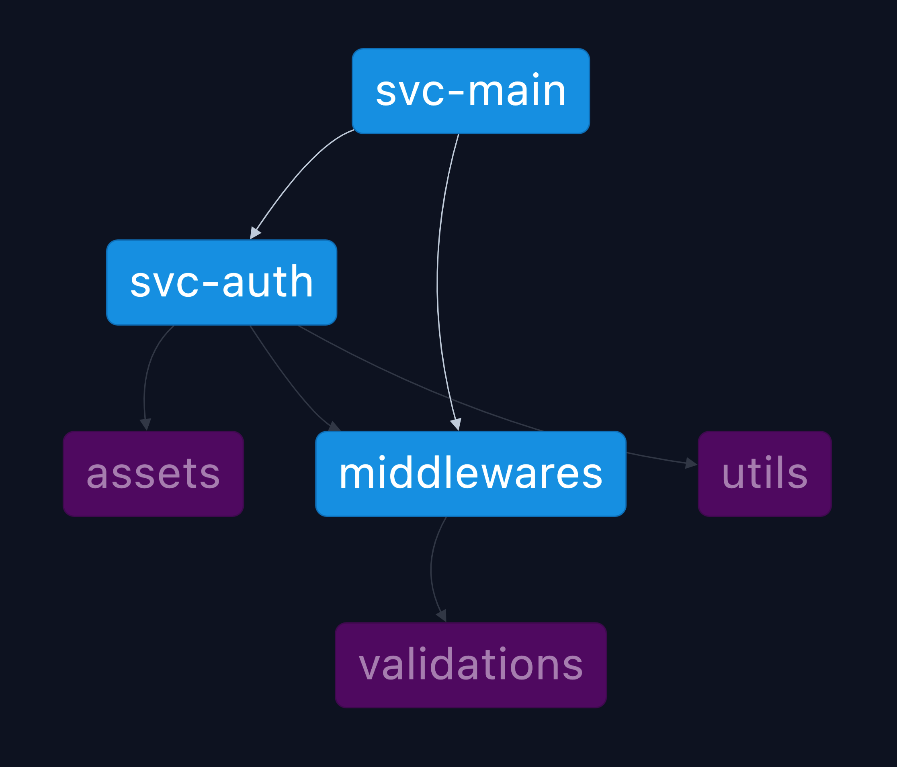

# test-nx-package-base

✨ **This workspace has been generated by [Nx, a Smart, fast and extensible build system.](https://nx.dev)** ✨

Visit the [Nx Documentation](https://nx.dev) to learn more.

## Understand this workspace

Run `nx graph` to see a diagram of the dependencies of the projects.

## Todo

1. Error when trigger `npx nx run middlewares:lint:fix`
2. Fix docker swarn build and deploy